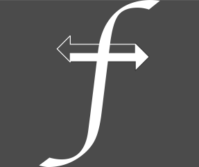

# GopherPEDS

## A GUI Tool for USPTO PEDS

(c) Vinz Frauchiger, 2021

GopherPEDS is a tool to access the PEDS System of the US Patent and Trademark Office.

It currently allows for catching the term extension days for an application id,
early publication number or patent number. When catching the days it also checks for
terminal disclaimer and gives notice about such disclaimer.

It further allows for downloading of full USPTO File Wrappers. Each file of the File
Wrapper will be downloaded as separate file in the following format:

            14567345_2015-07-15T00_00_00.000Z_Claims.pdf

            ApplIdFiling_Date&Time_TypeOfDocument.pdf

But before you go on ```Get Filewrapper ...``` you may want to set the directory where your files
should be directed to! This is done by clicking ```Get Save Directory```, choose the appropriate
directory and click on ```Open```, the selected directory is then shown above the ```Get Save Directory```-Button
instead of "$HOME". In case you don't select a target directory, all downloaded files will be saved to your home directory.

The third function allows for just downloading the "latest" claims, which means the youngest pdf file of the File Wrapper with
the description "CLAIMS". Before clicking on ```Get Latest Claims``` you may really want to set a target directory! (ref. above).

Ther is a check box ```Turbo``` near the bottom, check this box to get insane download speed! By default the program used three simultaneous
downloads, by checking the box each file is a download routine (parallel).

There is a progress bar located at the bottom of the main window which show the progress of download operations (not used if only
term is requested).

If you are confronted with the unpleasent task of getting the term extension for numerous patents, there is an additional function called ```File List Proc.```! This list processor takes an xlsx-File (Excel) and reads the first column of the first table. An Example of a possible table is given as follows:

    publnos
    US2021236729 AA
    US2021038163 AA
    US9974492 BA
    US2019107969 AA
    US10272200 BB

It gets term extensions and checks for terminal disclaimers for all publication and saves the information to a new table called "TermExtList" in the file containing the publication list.

1. Select the ```Get File```-Button to navigate to the correct file.
2. The file name should now be shown in the row of the List processor.
3. Select the ```Go List Proc.```-Button to start the list processor.
4. If the terms/disclaimers are downloaded succesfully the word "Success" is shown instead of the file name.


## To build the application

_Prerequisites_:

- You need to have Go 1.16+ (golang.org) installed
- You need to have Fyne (Fyne.io) with cmd installed:

        go get fyne.io/fyne/v2
        go get fyne.io/fyne/v2/cmd/fyne

_Steps_:

1. Clone the repo to your preferred location
2. change into the GopherPEDS directory
3. ```go build``` the application (may be omitted as Fyne does it as well)
4. ```fyne package -icon icon.png -name GopherPEDS -appVersion x.x.x -os yourOS``` to package the application (tested on MacOS Big Sur and Win 10 (20H2))

This app has no intention to have any commercial aspect! Use it or change it.

*Credits to all GO developers! Credits to the Fyne Team!*

  

... and may your appropriate God bless the **Cheese Makers**!

**While this software is released under MIT license, further licenses apply due the use of Go and Go Libraries! The Ypsomed Logo is exclusively owned by Ypsomed AG.**

August 23, 2021, Vinz Frauchiger
